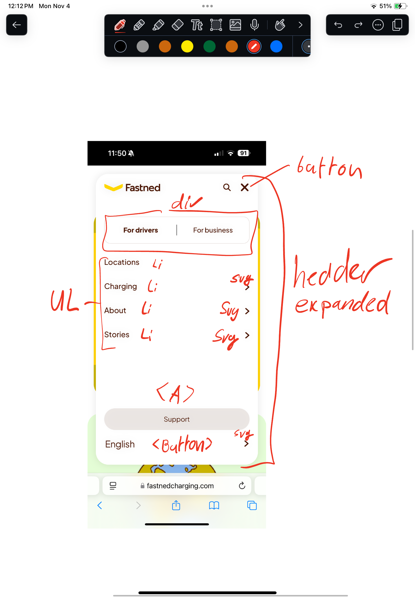

# Procesverslag
Markdown is een simpele manier om HTML te schrijven.  
Markdown cheat cheet: [Hulp bij het schrijven van Markdown](https://github.com/adam-p/markdown-here/wiki/Markdown-Cheatsheet).

Nb. De standaardstructuur en de spartaanse opmaak van de README.md zijn helemaal prima. Het gaat om de inhoud van je procesverslag. Besteedt de tijd voor pracht en praal aan je website.

Nb. Door *open* toe te voegen aan een *details* element kun je deze standaard open zetten. Fijn om dat steeds voor de relevante stuk(ken) te doen.

## Jij

  
uitwerken voor kick-off werkgroep

  ### Auteur:
  Peter Marinello

  #### Je startniveau:
  Rood

  #### Je focus:
   Ik wilde de pagina responsive maken, echter ben ik uiteindelijk toch overgestapt naar de surface plane. Dit koste toch iet wat minder tijd dan responsive design.
 

## Je website

  
uitwerken voor kick-off werkgroep

  ### Je opdracht:
  Ik ga deze site namaken: (https://www.fastnedcharging.com/en)

  #### Screenshot(s) van de eerste pagina (small screen): 
  Fastned Home Page

  

  #### Screenshot(s) van de tweede pagina (small screen):
  Fastned Sustainability and Reporting Page

  
 

## Toegankelijkheidstest 1/2 (week 1)

  
uitwerken na test in 2e werkgroep

  ### Bevindingen
  Lijst met je bevindingen die in de test naar voren kwamen:

  - Veel beeldspraak / de titels & teksten zijn niet allemaal even makkelijk om te lezen
  - Geen support voor dark mode of high contrast mode
  - Geen alt titels bij images

## Breakdownschets (week 1)

  
uitwerken na afloop 3e werkgroep

  ### de hele pagina: 
  
  
  
  
  

  ### dynamisch deel (bijv menu): 
  

  ### wellicht nog een dynamisch deel (bijv filter): 
  

## Voortgang 1 (week 2)

  
uitwerken voor 1e voortgang

  ### Stand van zaken
  Ik heb een begin gemaakt aan de HTML en de eerste pagina is bijna af. De CSS en JS ben ik nog niet aan begonnen.

  ### Agenda voor meeting
  Mijn groepje en ik hebben eigenlijk geen enkele keer onze vragen vooraf doorgenomen omdat we allemaal met andere specifieke vragen zaten.

  Voor mij is deze week de vraag of mijn HTML klopt of niet.

  ### Verslag van meeting
  hier na afloop snel de uitkomsten van de meeting vastleggen

  - Meer UL gebruiken in plaats van losse a-links of buttons onder elkaar.
  - Kijk nog eens goed naar je sections / divs

## Toegankelijkheidstest 2/2 (week 4)

  
uitwerken na test in 9e werkgroep

  ### Bevindingen
  Lijst met je bevindingen die in de test naar voren kwamen (geef ook aan wat er verbeterd is):
  
  Wat er verbeterd is:

  - Er is een darkmode toegevoegd
  - Relevante images hebben een alt titel ontvangen

  Wat er verslechterd is:

  - toetsenbord navigatie werkt niet (voor zo ver ik weet)
  

## Voortgang 3 (week 4)

  
uitwerken voor 3e voortgang

  ### Stand van zaken
  Mooie vooruitgang geboekt, beide HTML pagina's zijn klaar en de CSS voor de Home Page is af. 

  ### Agenda voor meeting
  Ik loop compleet vast met de vormgeving van section waarbij twee elementen als een puzzel in elkaar klikken. Ik heb dit eerst met Skew geprobeerd, maar deze methode is helaas niet mogelijk. Echter loop ik ook vast met Clip Path's.
  Hoe kan ik dit fixen?

  ### Verslag van meeting
  hier na afloop snel de uitkomsten van de meeting vastleggen

  - Wellicht de clippath met figma maken en dan de svg code plakken in de HTML
  - Header menu moet worden uitgewerkt!!

## Eindgesprek (herkansing)

  
uitwerken voor eindgesprek

  ### Je uitkomst - karakteristiek screenshots:
  

  ### Dit ging goed/Heb ik geleerd: 
  De CSS schrijven ging over het algemeen erg goed en ik ben trots op de verschillende resultaten die ik heb behaald. 1 van deze mooi resultaten is de werkende email signup pop-up, die ook checkt of je een naam langer dan 2 karakters hebt ingevoeerd (zonder bijzondere tekens) en of je een valide email hebt ingevuld.

  

  ### Dit was lastig/Is niet gelukt:
  In het laatste feedback gesprek heb ik van danny mooie en leerzame feedback ontvangen. Wat er namelijk bij mij fout is gelopen is het te lang vast blijven zitten in een code probleem. Tuurlijk is het belangrijk dat je niet direct opgeeft wanneer je tegen een probleem aan loopt, echter is er ook een moment dat je tegen jezelf moet zeggen "en nu door naar het volgende probleem". Dit is iets waar ik flink aan ga werken dit schooljaar en hoop dat bij project tech op de proef te kunnen stellen.

  Hieronder zie je de vormgeving van de originele Fastned website, helaas is dit mij dus niet gelukt. Al heb ik het met een prima alternatief opgelost. 

  Verder vind ik dat ik mijn code een stuk eleganter kan opmaken, met meer comments tussen de verschillende CSS sections bijvoorbeeld. Dit vergeet ik vaak te doen als ik in een flow zit, maar achteraf alles bijwerken is dan een enorme klus. Ook dit wil ik graag verbeteren aan mijn codeer skills dit jaar.

  Tot slot is het me helaas niet meer gelukt om binnen de tijd de "home"-knop te laten functioneren, relatief makkelijk te doen, maar helaas geen tijd meer voor. Dit zelfde geldt voor de mail sign-up knop op de tweede pagina, die werkt niet, maar ik weet alleen niet waarom.

  

## Bronnenlijst

Verre weg de grootste bron die ik heb gebruikt is ChatGPT. Deze bron bestond uit een tal van verschillende chats, waaruit verschillende stukken code zijn gekomen. Helaas ondersteund ChatGPT het delen van chat met daarin bestanden nog niet, waardoor ik deze chats niet direct kan delen.
Uiteraard laat ik deze maar al te graag zien tijdens het mondeling zo nodig.

  1. Bounding box / scroll animatie - bron : https://chatgpt.com/share/6717c256-0360-8000-9a5c-3812094531e7 
  2. Email + naam verificatie - bron: stack overflow - onderste comment op de pagina (code komt van persoon met username Gudvit) https://stackoverflow.com/questions/3073850/javascript-regex-test-peoples-name
  3. Email pop up: https://chatgpt.com/share/6717c256-0360-8000-9a5c-3812094531e7 
  4. Checkmark animatie: https://developedbyed.com/p/the-ultimate-javascript-animation-course
  5. Dark theme: https://chatgpt.com/share/6717c256-0360-8000-9a5c-3812094531e7 
  6. Reduce Motion: https://www.w3.org/WAI/WCAG22/Techniques/css/C39.html

